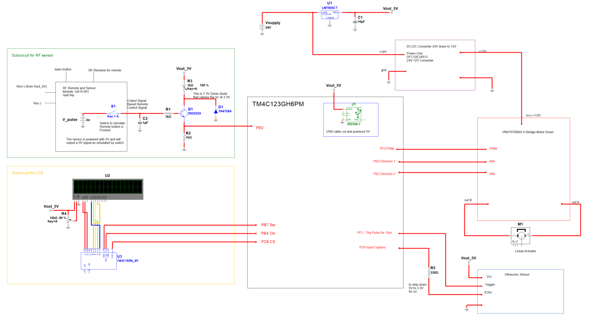
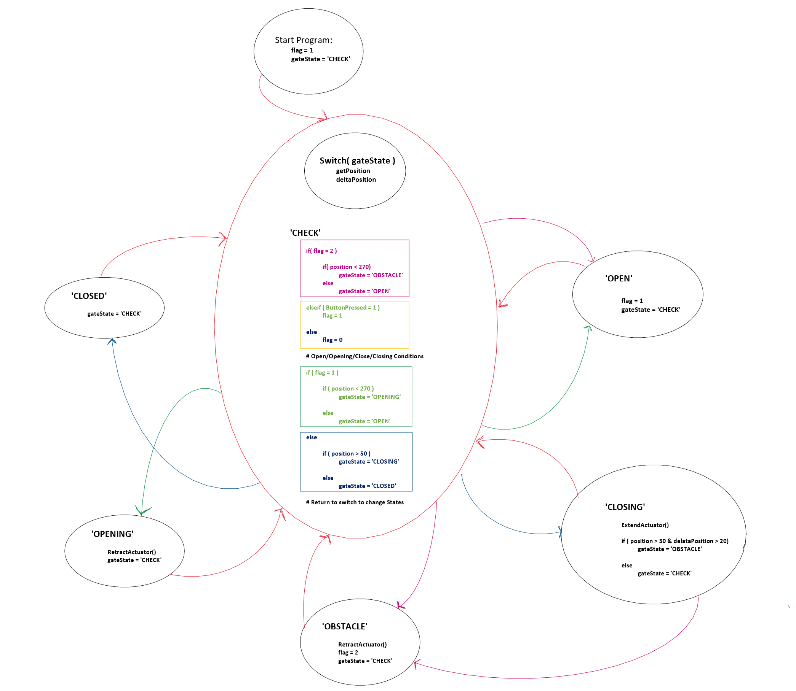

# Gate Opener Firmware — TIVA C TM4C123GH6PM Board

## Overview

This folder contains the firmware for the automatic sliding gate opener, developed using bare-metal programming on the Texas Instruments TM4C123GH6PM microcontroller. The firmware was developed in December 2024 as part of coursework at California State University, Fullerton. The gate is controlled wirelessly using a QiaChip 433MHz RF remote, driven by an EcoWorthy linear actuator through an L298N H-bridge motor driver, and monitored by an HC-SR04 ultrasonic sensor for position tracking and obstacle detection. Gate status is displayed on a 16x2 LCD display via SPI using a shift register.

---

## Hardware Components

| Component | Part | Protocol | Purpose |
|-----------|------|----------|---------|
| Microcontroller | TI TM4C123GH6PM (Tiva C) | — | Main processing unit |
| RF Module | QiaChip QA-R-011 (433MHz) | Logic High/Low | Wireless remote control receiver |
| LCD Display | 16x2 LCD + SN74HCT595 Shift Register | SPI | Displays gate status and position |
| Distance Sensor | HC-SR04 Ultrasonic Sensor | Timer Input Capture | Measures gate position and detects obstacles |
| Linear Actuator | EcoWorthy Linear Actuator | — | Simulates gate open/close motion (25.4cm stroke, ~1cm/s) |
| Motor Driver | L298N H-Bridge | PWM + GPIO | Controls linear actuator direction and speed |

---

## Peripheral Map

| Peripheral | Function | Details |
|------------|----------|---------|
| SPI1 (SSI2) | 16x2 LCD Display + SN74HCT595 | Shared SPI bus, chip select via PB7 |
| Timer0A | HC-SR04 Ultrasonic Sensor | Input capture mode — measures rising/falling echo edge |
| Timer2A | L298N Motor Driver | PWM output to control linear actuator speed at 100% duty cycle |
| Timer3A | Periodic sampling | Used for displacement tracking during open/close phase |
| GPIO (PE0) | QiaChip RF Receiver | Reads latched logic high/low from remote ON/OFF button |
| GPIO (PB0/PB1) | L298N INA/INB | Direction control signals for H-bridge (extend/retract) |

---

## Schematic

*Figure 1: Full gate opener schematic including all subcircuits.*

## State Machine

The firmware is implemented as a **Finite State Machine (FSM)** that manages all peripherals based on two inputs: the RF remote signal and the ultrasonic sensor position reading.

*Figure 2: FSM state diagram for the gate opener firmware.*

### Position Boundaries

Gate state is determined by the distance measured from the ultrasonic sensor to the wall:

| Range | State Region |
|-------|-------------|
| > 270mm | OPEN |
| 50mm – 270mm | OPENING / CLOSING / OBSTACLE |
| < 50mm | CLOSED |

### States

| State | Description |
|-------|-------------|
| `CHECK` | Reads ultrasonic distance and RF signal to determine the next gate state |
| `OPEN` | Gate is fully open; ultrasonic reads > 270mm, remote latched HIGH |
| `OPENING` | Linear actuator is retracting; gate is moving toward open position |
| `CLOSED` | Gate is fully closed; ultrasonic reads < 50mm, awaiting open command |
| `CLOSING` | Gate is closing; displacement is continuously monitored for obstacles |
| `OBSTACLE` | Large displacement detected during closing; gate reverses to OPEN until obstacle clears |

The obstacle detection threshold is set to a maximum displacement of **50mm**. If the measured displacement between consecutive readings exceeds this limit during the CLOSING state, the FSM transitions to OBSTACLE and reverses the gate.

---

## Functionalities

### QiaChip RF Remote Controller

The QiaChip QA-R-011 is a 433MHz RF receiver module configured in **Latch Mode**. In this mode, pressing the ON button on the remote signals a logic HIGH output, and the OFF button signals a logic LOW. Since the receiver operates at 5V and the Tiva C GPIO only tolerates 3.3V, a PNP BJT switch with a 3.3V Zener diode in series with a 330Ω resistor is used to step down the signal without logic inversion. The converted 3.3V signal is read at GPIO port PE0.

To configure Latch Mode on the receiver, press the learning button 3 times, wait a few seconds until the LED turns on, then press both the ON and OFF buttons on the remote to register them.

### Linear Actuator Control

The EcoWorthy linear actuator has a stroke length of approximately 25.4cm and operates at ~1cm/s under a 12V supply. It is driven by the L298N H-bridge motor driver, which receives a PWM signal from Timer2A and direction signals (INA/INB) from GPIO. Due to the L298N's inefficiency, 100% PWM duty cycle is required to drive the actuator at full speed, resulting in a measured average motor voltage of approximately 6V — most of the power is dropped across the driver itself.

### Ultrasonic Sensor (HC-SR04)

The HC-SR04 is connected to the Tiva C using Timer0A in input capture mode. A 10µs trigger pulse is sent to the sensor, which then emits an ultrasonic burst and holds the echo pin HIGH until the sound returns. The Tiva C measures the time between the rising and falling edges of the echo signal to calculate distance.

Since the sensor outputs a 5V echo signal, a 220Ω resistor is used to drop the voltage close to 3.3V before connecting to the Tiva C input pin.

During the OPENING and CLOSING states, the sensor continuously samples gate position and calculates displacement between readings. A displacement greater than 50mm during closing triggers the OBSTACLE state. Known issue: the sensor occasionally produces outlier readings that can cause unintended state transitions. Potential fixes include averaging multiple samples or using two sensors for autocorrelation.

### LCD Display

The 16x2 LCD display communicates with the Tiva C via **SPI (SSI2)**. A **SN74HCT595 shift register** converts the 3-wire serial signal (clock, data, chip select) to the 8-bit parallel interface required by the LCD. This reduces the pin count from 8+ to just 3 GPIO pins on the Tiva C.

The LCD displays the current gate state (OPEN, OPENING, CLOSING, CLOSED, OBSTACLE) and the live distance reading from the ultrasonic sensor during movement. Known issue: mechanical jolts from the linear actuator can cause ground loop interference that corrupts the LCD message. Pressing reset reinitializes the display. Soldering the LCD and MCU to a perf board can potentially reduce the ground loop.

---

## Installation

Built with **Texas Instruments Code Composer Studio (CCS) v12.3.0** on Windows.

1. Open Code Composer Studio and select **File → Import → Existing Projects into Workspace**
2. Navigate to the `rf_Integrated/` folder and import the project
3. Connect the Tiva C  via USB
4. Select **Run → Debug** to build and flash the firmware to the board
